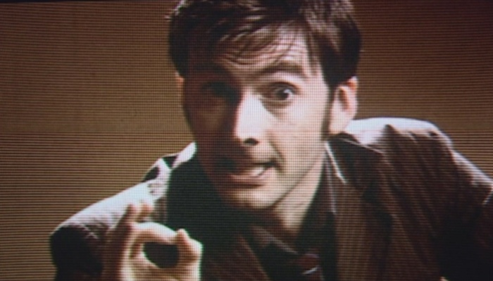

# dontblink


## About
**NOTE:** this is a work in progress and is by no means perfect

A program for X11 to set the desktop wallpaper to a series of stills (or gifs) of the tape of a weeping angel from _The Time of Angels_, and cycle through them whenever the desktop cannot be seen.

The code to set the wallpaper is taken from the awesome [asetroot](https://github.com/Wilnath/asetroot) by [@Wilnath](https://github.com/Wilnath)

Developed and works on awesomewm, currently doesn't work on i3 or plasma, others untested.

## Installation
Install dependencies:
```
pacman -S base-devel imagemagick imlib2
```
(or whatever your package manager is)

Clone the repo and setup:
```
git clone https://github.com/mmmsoup/dontblink
cd dontblink
./install.sh
```

Run `dontblink -h` for usage info

## To-Do
- make it work on plasma and i3 (hopefully others too)
- improve how checking whether desktop can be seen is done
- restore previous wallpaper after program is terminated

---



_Don't blink. Blink and you're dead. They are fast, faster than you could believe. Don't turn your back, don't look away, and don't blink._